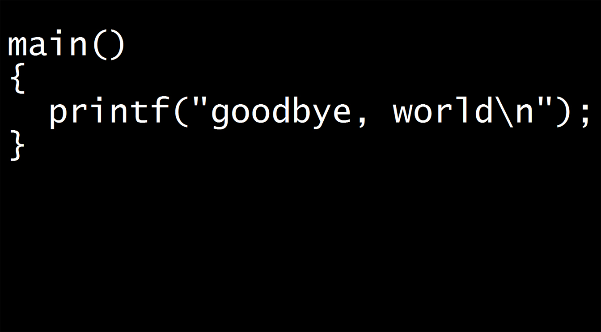

# Welcome to Alex Lin's GitHub Pages!

> Insert inspirational quote here

`print(goodCodingPractices)`

## About Me

I am a third year student at **_Univeristy of California San Diego_** studying **Computer Science**. I have a passion for Software Development and love researching and learning new technologies.

```
Current Tech/Software Interests:
1. Web Development - Frontend and Backend
2. JavaScript
3. Golang

Hobbies:
1. Running
2. Drawing
3. Piano
4. Video Games
5. Chess
```

## Links

[Linkedin](https://www.linkedin.com/in/alex-lin0/)

[GitHub](https://github.com/Pootisplank/)

[Resume](**resume.pdf**)

## Skills

1. Programming Languages
   - Python, Java, C++, JavaScript
2. Data Management
   - MongoDB, MySQL
3. Other
   - Agile, Git/GitHub, PowerBi

## Experience

1. Internships (See Resume for Details)
   - Toyota SWE Summer 2020
   - Incoming Salesforce SWE Summer 2021
2. Projects
   - PoE Flipper - Website for Path of Exile pricing data

## Goals

- [x] Do a web dev project.
- [ ] Integrate a database into a website.
- [ ] Learn more JavaScript.
- [ ] Contribute to an open source project.
- [ ] Do a project with Golang.
- [ ] ~~Learn to cook.~~

## Thanks for visiting and reading!


